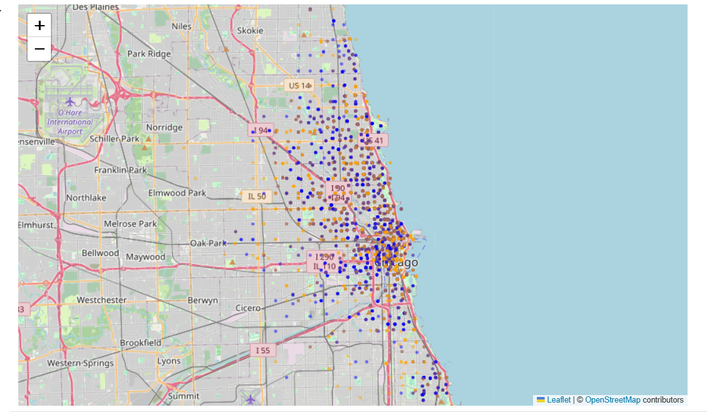

# Azure Divvy Bike-Share Data Analysis

Cloud-based analysis of **821,000+ Divvy bike-share trips** using Azure Machine Learning, Python, Pandas, data visualization, and spatial analysis.

## Project Objective

This project analyzes Divvy bike-share trip data to understand how **casual riders and annual members differ in their travel behavior**. The workflow was developed and executed in **Azure Machine Learning**, demonstrating an end-to-end cloud analytics process from data access and cleaning through exploratory analysis, visualization, spatial analysis, and delivery of analytical outputs.

## Technology Stack

- Microsoft Azure Machine Learning
- Azure Blob Storage
- Python
- Pandas
- Matplotlib
- Folium
- Jupyter Notebook
- GitHub

## Data Preparation

The original dataset contained **822,410 trip records**. Data quality checks and preparation included:

- Examining column structure and data types
- Identifying missing values
- Checking duplicate records and ride IDs
- Converting trip timestamps to datetime format
- Calculating trip duration
- Removing 82 zero/negative-duration records
- Investigating unusually long trips
- Removing trips exceeding 24 hours

The final analytical dataset contained **821,717 trips**.

## Key Findings

| Metric | Result |
|---|---:|
| Cleaned trips | 821,717 |
| Casual rider trips | 441,446 |
| Member trips | 380,271 |
| Average casual trip duration | 27.52 min |
| Average member trip duration | 14.06 min |
| Casual trips occurring on weekends | 39.13% |
| Member trips occurring on weekends | 26.10% |

### Rider Behavior

Casual riders took substantially longer trips on average than members. Casual riders also showed stronger weekend usage, while members were more concentrated on weekdays.

### Time-of-Day Patterns

Hourly analysis showed clear differences in usage throughout the day, including strong late-afternoon activity. Member behavior displayed patterns consistent with more regular weekday travel, while casual usage was distributed more broadly.

### Bike Preferences

Classic bikes were the most frequently used bike type for both groups. Docked bikes appeared only among casual riders in this dataset.

## Spatial Analysis

Trip-origin coordinates were analyzed to examine the geographic distribution of bike-share activity across Chicago.

An interactive **Folium map** was created to compare member and casual trip origins and visualize spatial concentrations across the service area.

## Repository Contents

- `divvy_trip_analysis.ipynb` — complete Azure ML/Python analysis
- `divvy_analysis_summary.csv` — final KPI summary
- `divvy_rider_map.html` — interactive spatial visualization

The full cleaned dataset is not included in this repository because of its size. Large-scale data processing and storage were handled in the Azure environment.

## Skills Demonstrated

**Cloud & Data Engineering:** Azure Machine Learning, Azure Blob Storage, cloud-based data access and processing

**Data Analysis:** Python, Pandas, data cleaning, exploratory data analysis, aggregation, feature engineering, KPI development

**Visualization:** Matplotlib, comparative analysis, analytical reporting

**Geospatial Analysis:** latitude/longitude analysis, spatial visualization, Folium interactive mapping

**Development Workflow:** Jupyter Notebook, GitHub, reproducible analytical documentation

## Project Workflow

`Azure Blob Storage → Azure Machine Learning → Python/Pandas → Data Cleaning → Exploratory Analysis → Feature Engineering → Visualization → Spatial Analysis → Analytical Outputs → GitHub`

### Spatial Analysis Visualization

*Spatial distribution of Divvy trip origins across Chicago, showing geographic patterns in member and casual rider activity.*

## Author

**Hanson Tawiah**  
M.S. Geography & GIS  
GIS | Data Analytics | Cloud & Geospatial Analysis
